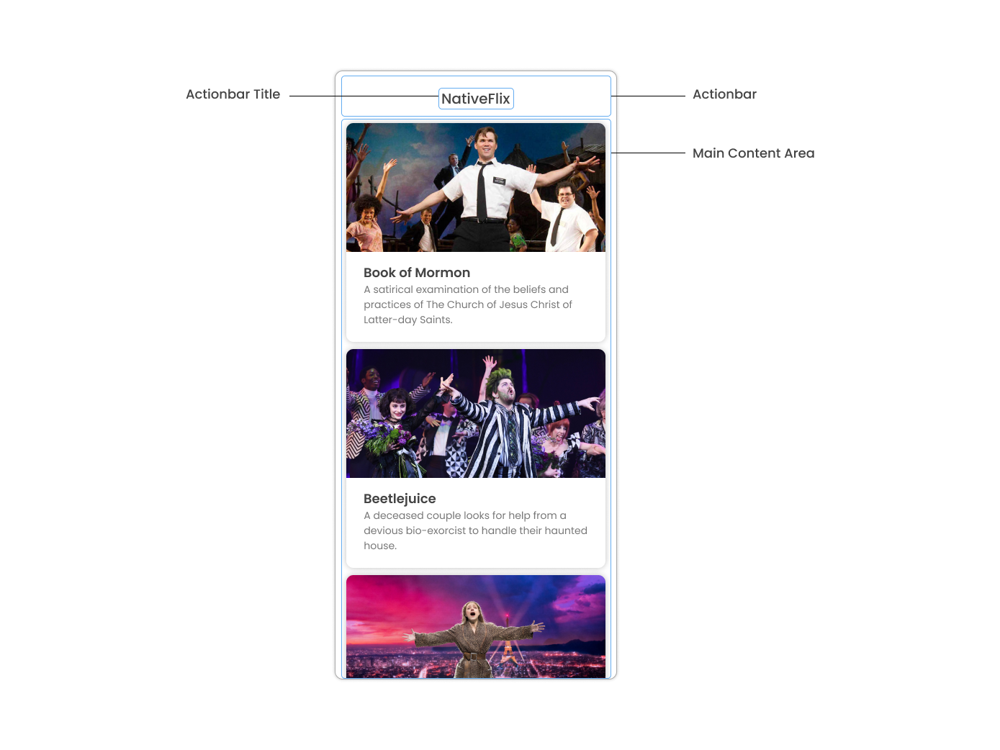
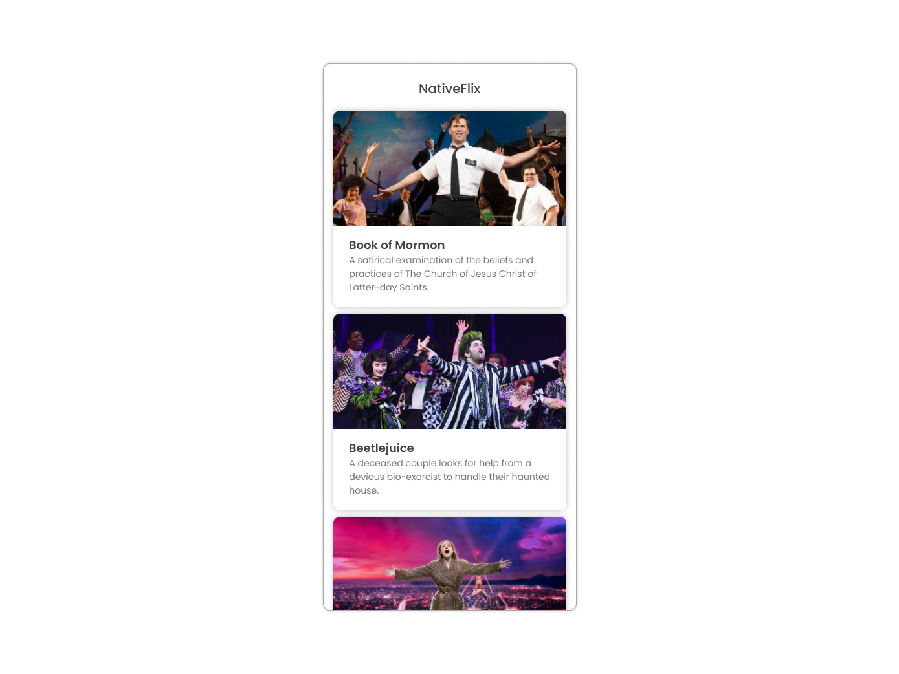
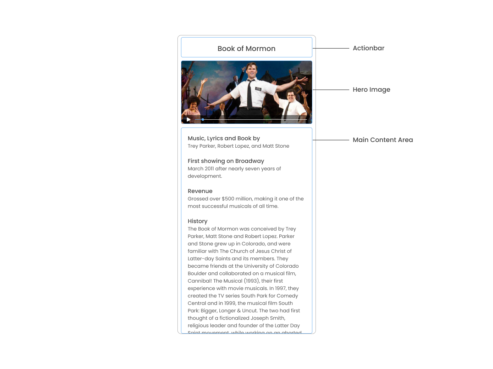
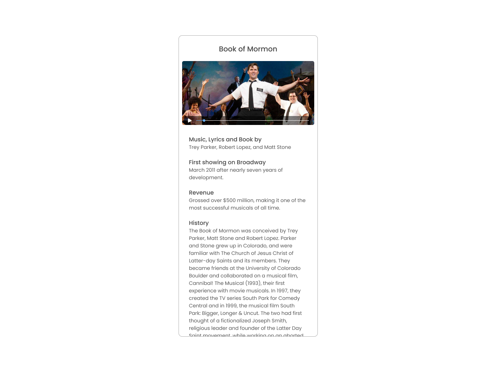

## Getting Started with React NativeScript

This tutorial introduces you to the fundamentals of using NativeScript with React by walking you through building an example app with some basic functionalities.

This tutorial will teach you the following:

- Build layouts using NativeScript components
- Add interactivity to your app using gestures
- Use routing to navigate between different views

## Prerequisites

To get the most out of this tutorial you should already have a basic understanding of React. If you're completely new to React, you might want to try the official [React tutorial](https://reactjs.org/tutorial/tutorial.html) first.

## Overview of the example application

You'll build a master-details app that displays a list of musicals and allows you to navigate to a details page to view more information about each musical.


You can find the complete source code of the application on [Github]()

## Set up your environment

To set up your development environment, follow the instructions in the [Environment Setup](https://docs.nativescript.org/environment-setup.html#windows-android) section of the docs.

## Create a new NativeScript application

We will be using Typescript for this tutorial. To create a new NativeScript Typescript application, run the CLI command `ns create` with the name of the application followed by `--react`.

```cli
ns create example-app --react
```

The NativeScript CLI creates a new directory with the root folder named `example-app` with an initial skeleton app project and installs the necessary packages and dependencies. This can take a few minutes and should be ready to run once it's done installing.

## Run the application

Go to the project's directory and run the following command to run it on the respective platforms.

```cli
cd example-app

// run on iOS
ns run ios

// run on Android
ns run android
```

The `ns run` command builds the app and launches the app on a connected Android device or Android emulator for Android and a connected iOS device or iOS simulator for iOS. By default, it listens for changes in your code, synchronizes those changes, and refreshes all selected devices.

## Folder structure

Based on the Typescript starter app, we will be creating the following file/folder structure for our application.

```
src
  |- components
      |- HomeScreen.tsx
      |- DetailsScreen.tsx
      |- NavigationParamList.tsx
      |- Navigator.tsx
  |- models
      |- flick.model.ts
  |- services
      |- flick.service.ts
  |- app.css
  |- app.ts
```

## Navigation setup

Let's start with the app's navigation. We will define a type for the navigation params to be used in our app's navigation. Create `NavigationParamList.ts` in the `components` directory and add the following:

```typescript
// src/components/NavigationParamList.ts

export type MainStackParamList = {
  Home: {}
}
```

## Create the home screen

Let's start with creating the file for our home screen with the following contents:

```tsx
// src/components/HomeScreen.tsx

import { RouteProp } from '@react-navigation/core'
import { FrameNavigationProp } from 'react-nativescript-navigation'
import { MainStackParamList } from './NavigationParamList'

type HomeScreenProps = {
  route: RouteProp<MainStackParamList, 'Home'>
  navigation: FrameNavigationProp<MainStackParamList, 'Home'>
}

export function HomeScreen({ navigation }: HomeScreenProps) {
  return <stackLayout></stackLayout>
}
```

## Navigation Container Setup

Next, set up the main navigation container to display the home component when navigated to `Home`. We'll also set `Home` as the initial route when the app starts. We can set the default route by passing the route name to the `initialRouteProperty` of the `Navigator` component. Open `Navigator.tsx` and add the following code:

```tsx
// src/components/Navigator.tsx

import * as React from 'react'
import { BaseNavigationContainer } from '@react-navigation/core'
import { stackNavigatorFactory } from 'react-nativescript-navigation'
import { MainStackParamList } from './NavigationParamList'
import { HomeScreen } from './HomeScreen'

const StackNavigator = stackNavigatorFactory()

export const mainStackNavigator = () => {
  return (
    <BaseNavigationContainer>
      <StackNavigator.Navigator initialRouteName="Home">
        <StackNavigator.Screen name="Home" component={HomeScreen} />
      </StackNavigator.Navigator>
    </BaseNavigationContainer>
  )
}
```

## Home UI

Before we create the UI of our home page, let's create our `FlickModel` and `FlickService` first. This will allow us to use the data directly in our template.

`FlickModel` will contain the shape of each flick object. Create a `models` directory inside `src` and create a new file called `flick.model.ts`. Open the new `flick.model.ts` and add the following `interface`:

```typescript
// src/models/flick.model.ts

export interface FlickModel {
  id: number
  genre: string
  title: string
  image: string
  url: string
  description: string
  details: {
    title: string
    body: string
  }[]
}
```

We will then use the `FlickModel` in our `FlickService` to return our flick data. Create a `services` directory inside `app` and create a new file called `flick.service.ts`. Open the new `flick.service.ts` and add the following:

```typescript
// src/services/flick.service.ts

import { FlickModel } from '../models'

class _FlickService {
  private flicks: FlickModel[] = [
    {
      id: 1,
      genre: 'Musical',
      title: 'Book of Mormon',
      image: '~/assets/bookofmormon.png',
      url: 'https://nativescript.org/images/ngconf/book-of-mormon.mov',
      description: `A satirical examination of the beliefs and practices of The Church of Jesus Christ of Latter-day Saints.`,
      details: [
        {
          title: 'Music, Lyrics and Book by',
          body: 'Trey Parker, Robert Lopez, and Matt Stone'
        },
        {
          title: 'First showing on Broadway',
          body: 'March 2011 after nearly seven years of development.'
        },
        {
          title: 'Revenue',
          body: 'Grossed over $500 million, making it one of the most successful musicals of all time.'
        },
        {
          title: 'History',
          body: 'The Book of Mormon was conceived by Trey Parker, Matt Stone and Robert Lopez. Parker and Stone grew up in Colorado, and were familiar with The Church of Jesus Christ of Latter-day Saints and its members. They became friends at the University of Colorado Boulder and collaborated on a musical film, Cannibal! The Musical (1993), their first experience with movie musicals. In 1997, they created the TV series South Park for Comedy Central and in 1999, the musical film South Park: Bigger, Longer & Uncut. The two had first thought of a fictionalized Joseph Smith, religious leader and founder of the Latter Day Saint movement, while working on an aborted Fox series about historical characters. Their 1997 film, Orgazmo, and a 2003 episode of South Park, "All About Mormons", both gave comic treatment to Mormonism. Smith was also included as one of South Park\'s "Super Best Friends", a Justice League parody team of religious figures like Jesus and Buddha.'
        },
        {
          title: 'Development',
          body: `During the summer of 2003, Parker and Stone flew to New York City to discuss the script of their new film, Team America: World Police, with friend and producer Scott Rudin (who also produced South Park: Bigger, Longer & Uncut). Rudin advised the duo to see the musical Avenue Q on Broadway, finding the cast of marionettes in Team America similar to the puppets of Avenue Q. Parker and Stone went to see the production during that summer and the writer-composers of Avenue Q, Lopez and Jeff Marx, noticed them in the audience and introduced themselves. Lopez revealed that South Park: Bigger, Longer & Uncut was highly influential in the creation of Avenue Q. The quartet went for drinks afterwards, and soon found that each camp wanted to write something involving Joseph Smith. The four began working out details nearly immediately, with the idea to create a modern story formulated early on. For research purposes, the quartet took a road trip to Salt Lake City where they "interviewed a bunch of missionaries—or ex-missionaries." They had to work around Parker and Stone\'s South Park schedule. In 2006, Parker and Stone flew to London where they spent three weeks with Lopez, who was working on the West End production of Avenue Q. There, the three wrote "four or five songs" and came up with the basic idea of the story. After an argument between Parker and Marx, who felt he was not getting enough creative control, Marx was separated from the project.[10] For the next few years, the remaining trio met frequently to develop what they initially called The Book of Mormon: The Musical of the Church of Jesus Christ of Latter-day Saints. "There was a lot of hopping back and forth between L.A. and New York," Parker recalled.`
        }
      ]
    },
    {
      id: 2,
      genre: 'Musical',
      title: 'Beetlejuice',
      image: '~/assets/beetlejuicemusical.png',
      url: 'https://nativescript.org/images/ngconf/beetlejuice.mov',
      description: `A deceased couple looks for help from a devious bio-exorcist to handle their haunted house.`,
      details: [
        {
          title: 'Music and Lyrics',
          body: 'Eddie Perfect'
        },
        {
          title: 'Book by',
          body: 'Scott Brown and Anthony King'
        },
        {
          title: 'Based on',
          body: 'A 1988 film of the same name.'
        },
        {
          title: 'First showing on Broadway',
          body: 'April 25, 2019'
        },
        {
          title: 'Background',
          body: `In 2016, a musical adaptation of the 1988 film Beetlejuice (directed by Tim Burton and starring Geena Davis as Barbara Maitland, Alec Baldwin as Adam Maitland, Winona Ryder as Lydia Deetz and Michael Keaton as Betelgeuse) was reported to be in the works, directed by Alex Timbers and produced by Warner Bros., following a reading with Christopher Fitzgerald in the title role. In March 2017, it was reported that Australian musical comedian Eddie Perfect would be writing the music and lyrics and Scott Brown and Anthony King would be writing the book of the musical, and that another reading would take place in May, featuring Kris Kukul as musical director. The musical has had three readings and two laboratory workshops with Alex Brightman in the title role, Sophia Anne Caruso as Lydia Deetz, Kerry Butler and Rob McClure as Barbara and Adam Maitland.`
        }
      ]
    },
    {
      id: 3,
      genre: 'Musical',
      title: 'Anastasia',
      image: '~/assets/anastasia.png',
      url: 'https://nativescript.org/images/ngconf/anastasia.mov',
      description: `The legend of Grand Duchess Anastasia Nikolaevna of Russia.`,
      details: [
        { title: 'Music and Lyrics', body: 'Lynn Ahrens and Stephen Flaherty' },
        {
          title: 'Book by',
          body: 'Terrence McNally'
        },
        {
          title: 'Based on',
          body: 'A 1997 film of the same name.'
        },
        {
          title: 'Background',
          body: `A reading was held in 2012, featuring Kelli Barret as Anya (Anastasia), Aaron Tveit as Dmitry, Patrick Page as Vladimir, and Angela Lansbury as the Empress Maria. A workshop was held on June 12, 2015, in New York City, and included Elena Shaddow as Anya, Ramin Karimloo as Gleb Vaganov, a new role, and Douglas Sills as Vlad.
        The original stage production of Anastasia premiered at the Hartford Stage in Hartford, Connecticut on May 13, 2016 (previews). The show was directed by Darko Tresnjak and choreography by Peggy Hickey, with Christy Altomare and Derek Klena starring as Anya and Dmitry, respectively.
        Director Tresnjak explained: "We've kept, I think, six songs from the movie, but there are 16 new numbers. We've kept the best parts of the animated movie, but it really is a new musical." The musical also adds characters not in the film. Additionally, Act 1 is set in Russia and Act 2 in Paris, "which was everything modern Soviet Russia was not: free, expressive, creative, no barriers," according to McNally.
        The musical also omits the supernatural elements from the original film, including the character of Rasputin and his musical number "In the Dark of the Night", (although that song’s melody is repurposed in the new number "Stay, I Pray You"), and introduces instead a new villain called Gleb, a general for the Bolsheviks who receives orders to kill Anya.`
        }
      ]
    }
  ]

  getFlicks(): FlickModel[] {
    return this.flicks
  }

  getFlickById(id: number): FlickModel | undefined {
    return this.flicks.find(flick => flick.id === id) || undefined
  }
}

export const FlickService = new _FlickService()
```

Next, let's break down the layout and UI elements of the home page.



The home page can be divided into two main parts, the action bar with the title and the scrollable main content area with the cards (we will talk about the cards in the next section). Let's start with creating the action bar with the title. Open `Navigator.tsx` and add the following code:

```tsx
// src/components/Navigator.tsx

import * as React from 'react'
import { BaseNavigationContainer } from '@react-navigation/core'
import { stackNavigatorFactory } from 'react-nativescript-navigation'
import { MainStackParamList } from './NavigationParamList'
import { HomeScreen } from './HomeScreen'

const StackNavigator = stackNavigatorFactory()

export const mainStackNavigator = () => {
  return (
    <BaseNavigationContainer>
      <StackNavigator.Navigator
        initialRouteName="Home"
        // New 👇
        screenOptions={{
          headerShown: true
        }}
      >
        <StackNavigator.Screen
          name="Home"
          // New 👇
          options={{
            title: 'NativeFlix'
          }}
          component={HomeScreen}
        />
      </StackNavigator.Navigator>
    </BaseNavigationContainer>
  )
}
```

Since we have an array of flicks to display we can use NativeScript's [`ListView`](https://docs.nativescript.org/ui-and-styling.html#listview) component. `ListView` is a NativeScript UI component that efficiently renders items in a vertical or horizontal scrolling list. Let's first create a variable called flick to our home component that we are going to use as our `ListView`'s data source. Open `HomeScreen.tsx` and add the following:

```tsx
// src/components/HomeScreen.tsx

import * as React from 'react'
import { ListView } from 'react-nativescript'
import { RouteProp } from '@react-navigation/core'
import { ItemEventData } from '@nativescript/core'
import { FrameNavigationProp } from 'react-nativescript-navigation'
import { MainStackParamList } from './NavigationParamList'

// Add this 👇
import { FlickService } from '../services/flick.service'

type HomeScreenProps = {
  route: RouteProp<MainStackParamList, 'Home'>
  navigation: FrameNavigationProp<MainStackParamList, 'Home'>
}

export function HomeScreen({ navigation }: HomeScreenProps) {
  // Add this 👇
  const flicks = FlickService.getFlicks()

  return <stackLayout height="100%"></stackLayout>
}
```

Next, add the `ListView` component:

```tsx
// src/components/HomeScreen.tsx

import * as React from 'react'
import { ListView } from 'react-nativescript'
import { RouteProp } from '@react-navigation/core'
import { ItemEventData } from '@nativescript/core'
import { FrameNavigationProp } from 'react-nativescript-navigation'
import { MainStackParamList } from './NavigationParamList'
import { FlickService } from '../services/flick.service'

// Add this 👇
import { FlickModel } from '../models'

type HomeScreenProps = {
  route: RouteProp<MainStackParamList, 'Home'>
  navigation: FrameNavigationProp<MainStackParamList, 'Home'>
}

export function HomeScreen({ navigation }: HomeScreenProps) {
  const flicks = FlickService.getFlicks()
  // Add this 👇
  const cellFactory = (flick: FlickModel) => {
    return <label text={flick.title} />
  }
  return (
    <stackLayout height="100%">
      // Add this 👇
      <ListView
        items={flicks}
        cellFactory={cellFactory}
        separatorColor="transparent"
        height="100%"
      />
    </stackLayout>
  )
}
```

`ListView` in NativeScript uses the `items` property as its data source. In the snippet above, we set the `items` property to `flicks`. The `ListView` then loops through the `flicks` array and uses the template in the `cellFactory` to render the contents for each entry. If you run the app now, you should see a list of flick titles.

### Create flick cards

Before we dive into creating the card below, let's create some classes for our background and text colors that we will be using in the application. As this will be shared throughout the application, let's add this to the `app.css`. Open `app.css` and add the following:

```css
/* src/app.scss */

/* applied when device is in light mode */
.ns-light .bg-primary {
  background-color: #fdfdfd;
}
.ns-light .bg-secondary {
  background-color: #ffffff;
}
.ns-light.text-primary {
  color: #444;
}
.ns-light.text-secondary {
  color: #777;
}

/* applied when device is in dark mode */
.ns-dark .bg-primary {
  background-color: #212121;
}
.ns-dark .bg-secondary {
  background-color: #383838;
}
.ns-dark .text-primary {
  color: #eee;
}
.ns-dark .text-secondary {
  color: #ccc;
}
```


As you can see in the image above, each card is made up of 3 components, the preview image, a title, and a description. We will be using a `GridLayout` as our container and use the `Image` and `Label` components for the preview image and texts. Open your `HomeScreen.tsx` and add the following:

```tsx
// src/components/HomeScreen.tsx

import * as React from 'react'
import { ListView } from 'react-nativescript'
import { RouteProp } from '@react-navigation/core'
import { ItemEventData } from '@nativescript/core'
import { FrameNavigationProp } from 'react-nativescript-navigation'
import { MainStackParamList } from './NavigationParamList'
import { FlickService } from '../services/flick.service'
import { FlickModel } from '../models'

type HomeScreenProps = {
  route: RouteProp<MainStackParamList, 'Home'>
  navigation: FrameNavigationProp<MainStackParamList, 'Home'>
}

export function HomeScreen({ navigation }: HomeScreenProps) {
  const flicks = FlickService.getFlicks()

  // Add this 👇
  const cellFactory = (flick: FlickModel) => {
    return (
      <gridLayout
        height="280"
        borderRadius="10"
        className="bg-secondary"
        rows="*, auto, auto"
        columns="*"
        margin="5 10"
        padding="0"
      >
        <image row="0" margin="0" stretch="aspectFill" src={flick.image} />
        <label
          row="1"
          margin="10 10 0 10"
          fontWeight="700"
          className="text-primary"
          fontSize="18"
          text={flick.title}
        />
        <label
          row="2"
          margin="0 10 10 10"
          className="text-secondary"
          fontSize="14"
          textWrap="true"
          text={flick.description}
        />
      </gridLayout>
    )
  }

  return (
    <stackLayout height="100%">
      <ListView
        items={flicks}
        cellFactory={cellFactory}
        separatorColor="transparent"
        height="100%"
      />
    </stackLayout>
  )
}
```

### Checkpoint

If you've followed along this far, running the app on either platform should result in an app that resembles the one in this screenshot, with the list being scrollable vertically.



## Create the details screen

Let's start with adding an entry for the Details screen to your `MainStackParamList`. Open `NavigationParamList.ts` and add the following:

```typescript
// src/components/NavigationParamList.ts

export type MainStackParamList = {
  Home: {}
  // Add this 👇
  Details: {
    flickId: number
  }
}
```

Next, create the file for our details screen with the following contents:

```tsx
// src/components/DetailsScreen.tsx

import { RouteProp } from '@react-navigation/core'
import { FrameNavigationProp } from 'react-nativescript-navigation'
import { MainStackParamList } from './NavigationParamList'

type DetailsScreenProps = {
  route: RouteProp<MainStackParamList, 'Details'>
  navigation: FrameNavigationProp<MainStackParamList, 'Details'>
}

export function DetailsScreen({ navigation }: DetailsScreenProps) {
  return <stackLayout></stackLayout>
}
```

### Setup navigation from home to details component

To be able to navigate to the details screen, we will need to add a `StackNavigator.Screen` component for the `Details` component in our `BaseNavigationContainer`. Open `Navigator.tsx` and add the following:

```tsx
import * as React from 'react'
import { BaseNavigationContainer } from '@react-navigation/core'
import { stackNavigatorFactory } from 'react-nativescript-navigation'
import { MainStackParamList } from './NavigationParamList'
import { HomeScreen } from './HomeScreen'

// Add this 👇
import { DetailsScreen } from './DetailsScreen'

const StackNavigator = stackNavigatorFactory()

export const mainStackNavigator = () => {
  return (
    <BaseNavigationContainer>
      <StackNavigator.Navigator
        initialRouteName="Home"
        screenOptions={{
          headerShown: true
        }}
      >
        <StackNavigator.Screen
          name="Home"
          options={{
            title: 'NativeFlix'
          }}
          component={HomeScreen}
        />
        // Add this 👇
        <StackNavigator.Screen name="Details" component={DetailsScreen} />
      </StackNavigator.Navigator>
    </BaseNavigationContainer>
  )
}
```

We will be using the `navigate` function from the `navigation` prop to navigate from our home component to the details component. In addition to the route name, we will also pass in the flick's `id` to the `navigate` function. We will use this `id` in our details component to access more information about the flick. Open `HomeScreen.tsx` and add the following:

```tsx
// src/components/HomeScreen.tsx

import * as React from 'react'
import { ListView } from 'react-nativescript'
import { RouteProp } from '@react-navigation/core'

// Add this 👇
import { ItemEventData } from '@nativescript/core'
import { FrameNavigationProp } from 'react-nativescript-navigation'
import { MainStackParamList } from './NavigationParamList'
import { FlickService } from '../services/flick.service'
import { FlickModel } from '../models'

type HomeScreenProps = {
  route: RouteProp<MainStackParamList, 'Home'>
  navigation: FrameNavigationProp<MainStackParamList, 'Home'>
}

export function HomeScreen({ navigation }: HomeScreenProps) {
  const flicks = FlickService.getFlicks()

  const cellFactory = (flick: FlickModel) => {
    return (
      <gridLayout
        height="280"
        borderRadius="10"
        className="bg-secondary"
        rows="*, auto, auto"
        columns="*"
        margin="5 10"
        padding="0"
      >
        <image row="0" margin="0" stretch="aspectFill" src={flick.image} />
        <label
          row="1"
          margin="10 10 0 10"
          fontWeight="700"
          className="text-primary"
          fontSize="18"
          text={flick.title}
        />
        <label
          row="2"
          margin="0 10 10 10"
          className="text-secondary"
          fontSize="14"
          textWrap="true"
          text={flick.description}
        />
      </gridLayout>
    )
  }

  // Add this 👇
  const onItemTap = (args: ItemEventDaa) => {
    const index = args.index
    const flick = flicks[index]
    navigation.navigate('Details', {
      flickId: flick.id
    })
  }

  return (
    <stackLayout height="100%">
      <ListView
        items={flicks}
        cellFactory={cellFactory}
        separatorColor="transparent"
        height="100%"
      />
    </stackLayout>
  )
}
```

Next, let's add the tap event to the listview items. Open `HomeScreen.tsx` and add the following:

```tsx
// src/components/HomeScreen.tsx

import * as React from 'react'
import { ListView } from 'react-nativescript'
import { RouteProp } from '@react-navigation/core'
import { ItemEventData } from '@nativescript/core'
import { FrameNavigationProp } from 'react-nativescript-navigation'
import { MainStackParamList } from './NavigationParamList'
import { FlickService } from '../services/flick.service'
import { FlickModel } from '../models'

type HomeScreenProps = {
  route: RouteProp<MainStackParamList, 'Home'>
  navigation: FrameNavigationProp<MainStackParamList, 'Home'>
}

export function HomeScreen({ navigation }: HomeScreenProps) {
  const flicks = FlickService.getFlicks()

  const cellFactory = (flick: FlickModel) => {
    return (
      <gridLayout
        height="280"
        borderRadius="10"
        className="bg-secondary"
        rows="*, auto, auto"
        columns="*"
        margin="5 10"
        padding="0"
      >
        <image row="0" margin="0" stretch="aspectFill" src={flick.image} />
        <label
          row="1"
          margin="10 10 0 10"
          fontWeight="700"
          className="text-primary"
          fontSize="18"
          text={flick.title}
        />
        <label
          row="2"
          margin="0 10 10 10"
          className="text-secondary"
          fontSize="14"
          textWrap="true"
          text={flick.description}
        />
      </gridLayout>
    )
  }

  const onItemTap = (args: ItemEventDaa) => {
    const index = args.index
    const flick = flicks[index]
    navigation.navigate('Details', {
      flickId: flick.id
    })
  }

  return (
    <stackLayout height="100%">
      <ListView
        items={flicks}
        cellFactory={cellFactory}
        // Add this 👇
        onItemTap={onItemTap}
        separatorColor="transparent"
        height="100%"
      />
    </stackLayout>
  )
}
```

### Access navigation props

We passed in the `id` of the flick card the user tapped on in the previous section as we navigate to the details page. We can access the passed in `id` via the `route.params` property. We can then use the `id` to get the selected flick information to be displayed in our details component's template. Open `DetailsScreen.tsx` and add the following:

```tsx
// src/components/DetailsScreen.tsx

import * as React from 'react'
import { RouteProp } from '@react-navigation/core'
import { FrameNavigationProp } from 'react-nativescript-navigation'
import { MainStackParamList } from './NavigationParamList'

// Add this 👇
import { FlickService } from '../services'

type DetailsScreenProps = {
  route: RouteProp<MainStackParamList, 'Details'>
  navigation: FrameNavigationProp<MainStackParamList, 'Details'>
}

// Update the input of this function 👇
export function DetailsScreen({ route }: DetailsScreenProps) {
  // Add this 👇
  const flickId = route.params.flickId
  const flick = FlickService.getFlickById(flickId)

  return <stackLayout></stackLayout>
}
```

### Details UI

Let's break down the layout and UI elements of the details page.



The details page can be divided into three main parts, the action bar with the flick title, the hero image, and the main content with the flick details. We will use the `details` array from our `flicks` object to populate the flick details section. The `details` array contains objects with a `title` and `body` which are rendered uniformly, each with their style. We can use Javascript's array `map` operator to loop through the `details` array and create a UI element or set of elements for each entry in the array. Open `DetailsScreen.tsx` and add the following code:

```tsx
// src/components/DetailsScreen.tsx

import * as React from 'react'
import { RouteProp } from '@react-navigation/core'
import { FrameNavigationProp } from 'react-nativescript-navigation'
import { MainStackParamList } from './NavigationParamList'
import { FlickService } from '../services'

type DetailsScreenProps = {
  route: RouteProp<MainStackParamList, 'Details'>
  navigation: FrameNavigationProp<MainStackParamList, 'Details'>
}

export function DetailsScreen({ route }: DetailsScreenProps) {
  const flickId = route.params.flickId
  const flick = FlickService.getFlickById(flickId)

  return (
    // Add this 👇
    <scrollView height="100%">
      <stackLayout>
        <image margin="0" stretch="aspectFill" src={flick?.image} />
        <stackLayout padding="10 20">
          {flick.details.map((flickDetails, index) => (
            <stackLayout key={index}>
              <label
                marginTop="15"
                fontSize="16"
                fontWeight="700"
                class="text-primary"
                textWrap="true"
                text={flickDetails.title}
              />
              <label
                fontSize="14"
                class="text-secondary"
                textWrap="true"
                text={flickDetails.body}
              />
            </stackLayout>
          ))}
        </stackLayout>
      </stackLayout>
    </scrollView>
  )
}
```

Next, set the title of the `ActionBar` to the title of the selected flick. We will use the `title` property from the `options` object of the details' `StackNavigator.Screen` component. Open `Navigator.tsx` and add the following:

```tsx
// src/Navigator.tsx

import * as React from 'react'
import { BaseNavigationContainer } from '@react-navigation/core'
import { stackNavigatorFactory } from 'react-nativescript-navigation'
import { MainStackParamList } from './NavigationParamList'
import { HomeScreen } from './HomeScreen'
import { DetailsScreen } from './DetailsScreen'

// Add this 👇
import { FlickService } from '../services'

const StackNavigator = stackNavigatorFactory()

export const mainStackNavigator = () => {
  // Add this 👇
  const flickTitle = flickId => FlickService.getFlickById(flickId).title
  return (
    <BaseNavigationContainer>
      <StackNavigator.Navigator
        initialRouteName="Home"
        screenOptions={{
          headerShown: true
        }}
      >
        <StackNavigator.Screen
          name="Home"
          options={{
            title: 'NativeFlix'
          }}
          component={HomeScreen}
        />
        <StackNavigator.Screen
          name="Details"
          // Add this 👇
          options={({ route }) => ({
            title: flickTitle((route.params as MainStackParamList['Details']).flickId)
          })}
          component={DetailsScreen}
        />
      </StackNavigator.Navigator>
    </BaseNavigationContainer>
  )
}
```

### Checkpoint

Running the app on either platform should now result in an app that resembles the one in this screenshot with the ability to navigate between the home and details pages.



## What's next

Congratulations! You built your first NativeScript app that runs on both iOS and Android. You can continue adding more [NativeScript UI components](https://docs.nativescript.org/ui-and-styling.html) (or build your custom UI components), or you could add some [native functionalities](https://docs.nativescript.org/native-api-access.html). The possibilities are endless!
